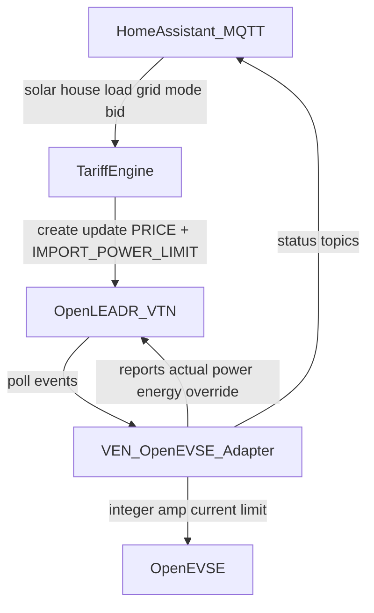

# Local OpenADR 3.1 EVSE Testbed (Milestone 1)

Stand up a local OpenADR 3.1 testbed that turns DTE tariff config plus Home Assistant telemetry into EVSE current limits via a marginal-cost supply curve, using OpenLEADR for the VTN and a Python tariff engine plus VEN adapter for business logic and OpenEVSE control.

Build a closed-loop prototype: synthesize a local marginal price, publish it through OpenADR 3.1, and drive OpenEVSE amperage. No forecasting, vehicle SOC, or deadline-aware bidding yet.

## Design invariants

- **DTE tariff** supplies the fixed external cost structure (config, not a live utility OpenADR feed).
- **Home energy / tariff engine** synthesizes the local marginal price and site constraints.
- **OpenADR** communicates that synthesized price and import allowance to the VEN.
- **VEN** decides charge/no-charge and the **integer amp** command for OpenEVSE.
- **Manual override and safety limits** sit outside economic logic. Charge Now bypasses price; it never bypasses hard safety.

Keep economics in **$/kWh**, not $/kW:

```text
Energy cost = kWh consumed × ($/kWh)
```

Power in kW is only the instantaneous operating constraint:

```text
P_EVSE ≤ P_available
```

The controller answers two questions separately:

1. Is charging economically desirable? (marginal $/kWh vs bid)
2. How much charging power is available? (solar surplus, service limits, house load, EVSE capacity, vehicle capability)

Example policy: charge when effective marginal energy cost is at or below $0.16/kWh, but never consume more than the locally available power budget. ($0.16/kWh means 16 cents/kWh.)

## Defaults (locked for this plan)

- **OpenADR**: 3.1 via [OpenLEADR/openleadr-rs](https://github.com/OpenLEADR/openleadr-rs) VTN (Docker + Postgres). Clients talk HTTP REST to the VTN; no dependency on the Rust VEN crate. Normative API: OpenADR Alliance OpenAPI YAML / definitions / user guide ([openadr.org OpenADR 3](https://www.openadr.org/openadr-3-0)). OpenADR 3.1 is not backward-compatible with 3.0.
- **Custom services**: Python (MQTT + HA ecosystem fit; VTN is language-agnostic over HTTP).
- **First vertical slice**: Economic mode + Charge Now override only. Solar-only and Ready-by-departure come later.
- **Lab path**: MQTT fixtures so the stack runs without live hardware; real HA sensors and OpenEVSE MQTT/HTTP as the production path.
- **Deploy topology**: Home Assistant Green (sensors, dashboard, Mosquitto or broker integration) plus a separate Linux host/VM for VTN, Postgres, tariff engine, and VEN. Compose on the Linux host for development.

## Architecture



### Component roles

**Home Assistant**

- Collect solar production, house consumption, grid import/export.
- Display mode, prices, charging status, overrides.
- Accept user inputs (bid price, user amp limit, mode). Departure time / required charge are later.
- Publish sensor values over MQTT.

**Tariff / business-logic service**

- Resolve weekday/weekend (and later seasonal) tariff periods.
- Calculate import price and Rider 18 export opportunity cost.
- Build the marginal power supply curve and accepted kW.
- Create/update OpenADR programs and events on the VTN (BL client). Does **not** command OpenEVSE amps.

**VTN (OpenLEADR)**

- Stores OpenADR resources (programs, events, reports).
- Makes events available to VENs; receives reports.
- Standards-compliant boundary; optimization stays outside the VTN.

**VEN / OpenEVSE adapter**

- Reads active `HOME_EV_FLEX` events (price + import power limit).
- Combines with local mode/override from MQTT.
- Converts to charge/no-charge and **integer amp** setpoint.
- Controls OpenEVSE via MQTT or HTTP; posts reports; mirrors status to HA.

## Repo layout (new)

```text
compose/                 # Docker Compose: VTN, Postgres, Mosquitto, tariff, ven
config/dte_tariff.yaml   # Editable DTE rates + Rider 18 credit
services/tariff_engine/  # Supply curve + OpenADR BL client
services/ven_adapter/    # Event consumer + OpenEVSE control + reports
ha/                      # MQTT topic contract + example HA package
tests/                   # Unit tests for supply curve and amperage math
docs/                    # Short runbook (dev + HA wiring)
```

## Marginal cost and supply curve

For each incremental watt of EV charging:

| Situation | Marginal cost |
| --- | --- |
| Importing from DTE | Current retail TOU import rate ($/kWh) |
| Consuming otherwise-exported solar | Rider 18 forgone export credit ($/kWh) |

Solar is not free; its opportunity cost is the export credit you would have received from DTE under Rider 18. See [DTE residential electric rate card](https://www.dteenergy.com/content/dam/dteenergy/deg/website/residential/Service-Request/pricing/residential-pricing-options/ResidentialElectricRateCard.pdf) for published rates (editable in config; subject to MPSC changes).

### Worked stack example

Inputs:

- Solar surplus: 3 kW
- Requested EV capacity: 7.7 kW
- Export credit: $0.07/kWh
- Import price: $0.18/kWh
- Bid: $0.16/kWh

| EV power slice | Marginal cost |
| --- | ---: |
| First 3 kW | $0.07/kWh |
| Remaining 4.7 kW | $0.18/kWh |

Only the first block is at or below the bid, so accepted continuous power is **3 kW** (not a blended $/kW).

### Supply stack every few seconds

| Source or power block | Available power | Marginal price |
| --- | ---: | ---: |
| Solar that would otherwise export | measured surplus kW | Rider 18 export credit |
| Grid import (off-peak or on-peak) | unlimited within site limit | matching TOU retail rate |
| Reserved emergency / service-head margin | not offered | effectively infinite |

Bid (from HA):

```text
maximum_energy_price = 0.16 USD/kWh
```

Dispatch:

```python
accepted_power_kw = sum(
    block.available_kw
    for block in supply_curve
    if block.price_per_kwh <= ev_bid_price
)

P_target_kw = min(
    accepted_power_kw,
    evse_maximum_kw,
    vehicle_maximum_kw,
    panel_service_headroom_kw,
    user_charging_limit_kw,
)
```

Effective marginal price published on the VTN is the price of the highest accepted block (or a short interval series of that value). `IMPORT_POWER_LIMIT` is the allowed grid-import portion for EV charging after solar-first acceptance (0 when only solar blocks clear the bid).

## Discrete amperage control (actuator)

OpenEVSE commands a **control-pilot current limit** in integer amps, not continuous watts.

Single-phase:

```text
I_raw = P_target_kw * 1000 / V_measured
I_floored = floor(I_raw)   # typical 1 A steps
```

If `I_floored < I_min` (about **6 A** J1772 minimum continuous), command **stop**, not 1–5 A. Else command `I_cmd` in `[I_min, I_max]`.

Reference at 240 V:

| Target power | Approximate current |
| ---: | ---: |
| 1.44 kW | 6 A |
| 2.88 kW | 12 A |
| 3.84 kW | 16 A |
| 5.76 kW | 24 A |
| 7.68 kW | 32 A |

Worked outcome: 3.0 kW surplus → `I_raw = 12.5` → floor to **12 A** (~2.88 kW).

**Deadband is amp hysteresis, not a power setpoint offset.** Do not implement `target = solar_surplus - 300 W` as continuous power control. Handle import/export chatter by:

- Conservative floor: never command an amp whose power exceeds available surplus when import is uneconomic.
- Hysteresis: only raise/lower `I_cmd` when surplus crosses into a new amp bucket by a configured margin (for example ~0.5–1.0 A headroom before stepping up; similar delay on step-down). Express margin in amps (or amp-equivalent watts at measured V).

**Ownership:** BL publishes price + import limit (and may expose diagnostic kW). **VEN owns** integer amp quantization, hysteresis, and the OpenEVSE command.

## Safety: never bypass

Charge Now and economic modes may differ on price, but neither may bypass:

- EVSE hardware current limit
- Branch-circuit limit
- Temperature protection
- Ground-fault protection
- Service / panel hard limit
- OpenEVSE internal safety logic

## Charging modes (Milestone 1)

### Economic

Charge only when accepted supply-curve blocks exist at `C_marginal <= C_bid`, then apply discrete-amp mapping and clamps.

### Charge now

Manual override: charge at user-selected **integer** current until stopped, unplugged, or a safety constraint applies. Bypasses economic signals only.

### Deferred

- **Solar only**: charge only from measured excess solar (economic mode already solar-first stacks; dedicated mode later).
- **Ready by departure**: raise bid as slack shrinks; needs energy remaining and departure time (out of scope).

## DTE tariff configuration

Do not rely on a live DTE feed. Store tariff as editable YAML. Include variable surcharges/credits that scale with kWh in the fully loaded marginal import price; exclude fixed monthly charges.

DTE 11 a.m.–7 p.m. option: weekday on-peak 11:00–19:00 local; off-peak 19:00–11:00 and all weekend. Rates are placeholders; fill from the current DTE rate card.

```yaml
utility: DTE
timezone: America/Detroit

import_rates:
  weekday:
    on_peak:
      start: "11:00"
      end: "19:00"
      price_per_kwh: 0.xxx
    off_peak:
      price_per_kwh: 0.xxx
  weekend:
    all_day:
      price_per_kwh: 0.xxx

export:
  rider_18_credit_per_kwh: 0.xxx

limits:
  panel_service_headroom_kw: 0.xxx
  evse_max_amps: 48
  branch_max_amps: 40
  i_min_amps: 6
  amp_hysteresis_amps: 0.75
```

## OpenADR program and payloads

Program: `HOME_EV_FLEX`

Milestone 1 signals only (conceptual payloads; map onto OpenADR 3.1 event values per OpenAPI):

### PRICE

```json
{
  "type": "PRICE",
  "units": "USD/kWh",
  "intervals": [
    {
      "start": "2026-07-18T22:00:00-04:00",
      "duration": "PT15M",
      "value": 0.07
    }
  ]
}
```

### IMPORT_POWER_LIMIT

```json
{
  "type": "IMPORT_POWER_LIMIT",
  "units": "kW",
  "value": 0.0
}
```

Clean division for Milestone 1:

- OpenADR event: **price** and **maximum site-import allowance**
- VEN: translates that plus local mode into **integer EVSE amperage**

Deferred signal shapes (not required for Milestone 1): `AVAILABLE_POWER`, `CHARGE_MODE`. Mode stays on HA MQTT.

### VEN reports (post to VTN)

- Actual EV power
- Delivered energy
- Accepted event
- Override status

## Closed-loop data path (Milestone 1)

1. HA publishes: solar production, house load, grid import/export, override mode, EV bid price, user amp limit.
2. Tariff engine determines: current DTE import price, Rider 18 export opportunity cost, solar-surplus power, supply-curve acceptance, PRICE + IMPORT_POWER_LIMIT.
3. VTN stores/serves those events.
4. VEN calculates charge/no-charge and target integer amps (with hysteresis and safety clamps).
5. OpenEVSE receives the current limit.
6. VEN reports actual power, energy, acceptance, override; mirrors status to HA.

## Component workstreams

### 1. Infrastructure

- Compose stack: OpenLEADR VTN + Postgres + Mosquitto; mount `config/`.
- Document VTN auth (OpenLEADR OAuth/fixtures), ports, and health checks.
- Dev MQTT publisher that mimics HA sensors for offline demos.

### 2. Tariff / business-logic service

- Subscribe to HA MQTT topics (solar, house load, grid, bid, mode).
- Resolve current import price from `config/dte_tariff.yaml` in `America/Detroit`.
- Build supply curve; compute accepted kW, effective marginal price, and import-power allowance.
- Upsert `HOME_EV_FLEX` events on the VTN as BL client (not amp commands).
- Unit tests for the worked stack: $0.07 / $0.18 / bid $0.16 → accepted 3 kW; at 240 V VEN floors to **12 A**.

### 3. VEN / OpenEVSE adapter

- Poll VTN for active `HOME_EV_FLEX` events.
- Map price + import limit + local mode to charge/no-charge and **integer amp** setpoint.
- Own amp quantization + hysteresis; never send fractional amps to OpenEVSE.
- Enforce never-bypass safety list; Charge Now bypasses economics only.
- Publish current limit to OpenEVSE (MQTT preferred; HTTP fallback).
- Post OpenADR reports; mirror status to HA over MQTT.

### 4. Home Assistant contract

- Document required sensors, number helpers (bid price, user amp limit), and mode selector (Economic / Charge Now).
- Example MQTT topic map and dashboard entities for price, target amps, override, and event acceptance.
- Concrete topic names and OpenEVSE command payloads are defined here during implementation (not assumed from an external private note).

## Implementation todos

1. Add Docker Compose for OpenLEADR VTN, Postgres, Mosquitto, and service stubs
2. Add editable DTE tariff YAML (schema above) and America/Detroit TOU resolver
3. Implement marginal supply curve plus discrete-amp quantization and amp hysteresis with intent-focused unit tests
4. Tariff engine: MQTT subscribe, compute targets, upsert HOME_EV_FLEX events on VTN
5. VEN: poll events, map to OpenEVSE current limit, enforce overrides/safety, post reports
6. Document HA MQTT topics, helpers, modes, and fixture publisher for lab demos
7. End-to-end lab script proving solar-first stacking and Charge Now override

## Success criteria (Milestone 1)

1. `docker compose up` brings up VTN, broker, tariff engine, and VEN with fixture MQTT.
2. With solar surplus 3 kW, export credit $0.07, import $0.18, bid $0.16: accepted 3 kW; VEN commands **12 A** at 240 V.
3. Surplus below `I_min` equivalent stops charging; never commands 1–5 A.
4. Amp hysteresis: small surplus noise around an amp boundary does not rapidly toggle adjacent amp setpoints.
5. Charge Now publishes integer user amps regardless of price; still respects configured hard max and never-bypass list.
6. VTN shows program/events; VEN reports appear after a charge interval.
7. Tests encode supply-curve intent plus discrete-amp quantization/hysteresis (bid threshold, solar-first stacking, floor-not-round, stop below 6 A).

## Explicitly out of scope for Milestone 1

- Ready-by-departure / rising bid vs slack
- Solar-only as a separate mode (beyond economic solar-first stacking)
- Vehicle SOC / OEM APIs
- HA add-on packaging
- OpenADR 3.0 compatibility
- Live DTE price feeds
- Capacity/policy adders beyond TOU import + Rider 18 export opportunity cost

## Suggested implementation order

1. Compose + Mosquitto + tariff YAML + supply-curve module with tests
2. VTN wiring (create program/event from tariff engine)
3. VEN amperage mapping + MQTT OpenEVSE (or fixture subscriber)
4. HA topic contract + end-to-end lab script
5. Short runbook in repo README

## References

- [OpenLEADR openleadr-rs](https://github.com/OpenLEADR/openleadr-rs) (OpenADR 3.1 VTN/VEN)
- [OpenADR 3 overview / OpenAPI](https://www.openadr.org/openadr-3-0)
- [DTE Residential Electric Rate Card](https://www.dteenergy.com/content/dam/dteenergy/deg/website/residential/Service-Request/pricing/residential-pricing-options/ResidentialElectricRateCard.pdf)
